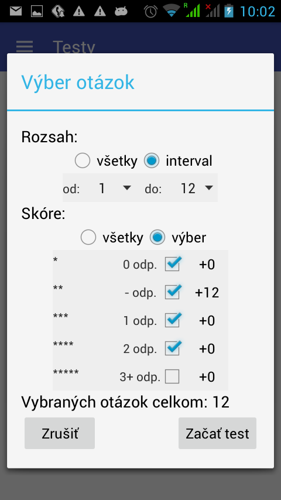

# Aplikácia Testy

# Aplikácia Testy
Cieľom aplikácie Testy je zefektívniť učenie sa prostredníctvom testov a aplikovať princípy školy hrou.
  
### Učiteľ
  Vytvára pre žiakov testy cez web rozhranie a má prehľad o ich priebežných výsledkoch.
  
### Žiak
Prostredníctvom android aplikácie si aktualizuje zoznam zadaných testov. Pre každý nový test má žiak počiatočné skóre 0% a testovaním sa so zadaných otázok sa mu skóre vylepšuje. V záložke Sieň slávy si vie pozrieť aktuálne skóre svojich spolužiakov. Súťaž vyhráva ten, kto prvý dosiahne 100%.
  	
###  Hodnotenie otázok
Každá otázka je ohodnotená od 1 po 5 hviezdičiek podľa nasledovného pravidla:

 * \* žiadna správna odpoveď
 * \*\* ešte neriešená otázka
 * \*\*\* jedna správna odpoveď
 * \*\*\*\* dve správne odpovede
 * \*\*\*\*\* aspoň tri správne odpovede
  
  ### Značenie otázok
  Po označení odpovede na otázku a jej vyhodnotení sa odpovede zafarbia nasledovne:
  
  * červená- označená nesprávna odpoveď
  * zelená- označená správna odpoveď
  * ružová- správna odpoveď, ktorá nie je označená

### HomeFragment
		- zoznam aktivnych testov a skore ktore k tym testom uzivatel ma
		- po kliknuti na test sa zobrazi dialog v ktorom si naklika rozsah otazok v teste a typ otazok(kazda otazka je ohodnotena podla toho kolkokrat nanu spravne odpovedal)
		- spusti sa QuestionActivity
### QuestionActivity
		- zobrazuju sa vybrane otazky a user oznacuje spravne odpovede, moze sa pohybovat aj dozadu na uz vyplnene odpovede, spravnost alebo nespravnost sa zobrazi okamzite. Oznaci odpovede, klikne na tlacitko dalej a odpovede sa vyhodnotia. Opetovnym klikom na dalej sa zobrazi nova otazka.
		- po vyhodnoteni poslednej otazky sa zobrazi statistika a user moze bud ukoncit cely test alebo zopakovat zle zodpovedane otazky
### HallOfFameFragment
		- v spinneri je vzdy vybrany jeden z testov
		- jednoduchy rebricek uzivatelov ktori aspon raz odpovedali na otazku v danom teste
### TutorialFragment
		- zakladne info o aplikacii
		- hodnotenie otazok
		- registracia mena

